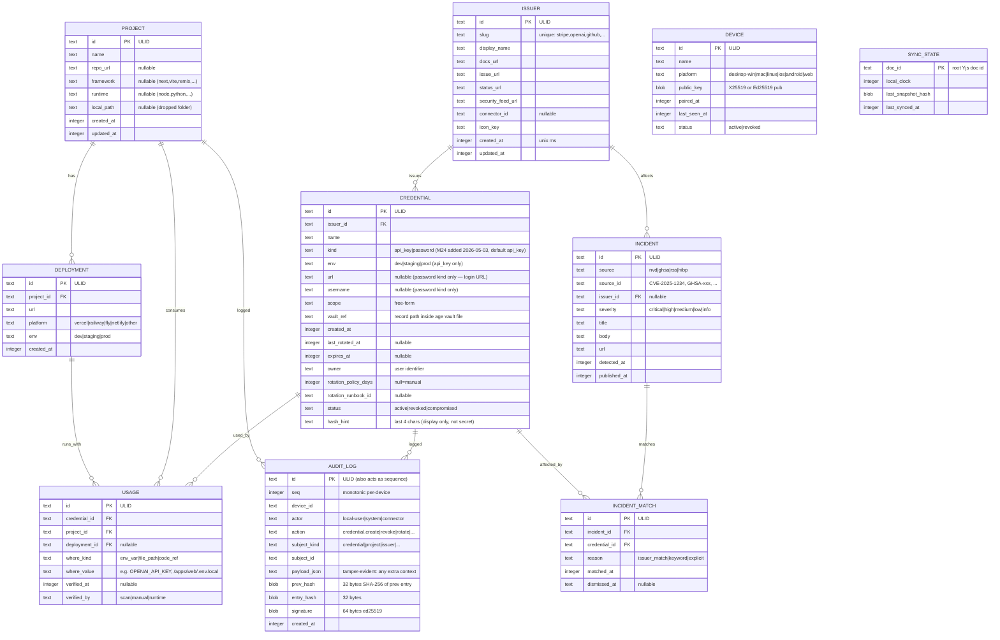

# Architecture — Secretbank

> 작성자: Planner Agent (claude-opus-4-7)
> 작성일: 2026-04-22
> 기반: docs/project-decisions.md (Gate 1 확정), docs/integrator_report.md, docs/ux_research.md, user_research/initial_idea.md, user_research/gemini_deep_research_Secretbank.md

---

## 0. 독자 가이드

이 문서는 Secretbank 시스템의 설계 지도다. 구현 순서는 `docs/task.md` 를, 태스크별 TDD 루프는 `docs/implementation_plan.md` 를 참조한다. 이 문서는 "왜 이 구조인가"와 "모듈 경계·데이터 모델·보안 경계"에만 집중한다.

**확정된 전제 (뒤집지 않음):**

- 플랫폼: Tauri v2 데스크톱(Win/Mac/Linux) + 모바일(iOS/Android) + Vite React 공용 웹 읽기 뷰어
- 보안: Zero-Knowledge, 로컬 암호화(`age` crate — 2026-04-22 Stronghold 에서 교체. project-decisions.md 참조), E2EE 멀티 디바이스 동기화(Yjs + SecSync)
- 인프라: Cloudflare Workers + D1 + KV 맹목 릴레이 (1인 운영, scale-to-zero)
- 결제: Paddle MoR (Web/Desktop) + RevenueCat + Apple IAP 15% + Google Play Billing
- 라이선스: AGPL-3.0 (코어) + EE 독점 (프리미엄/릴레이)
- 인증: Passkey (WebAuthn) + OAuth (GitHub, Google)
- 디자인: shadcn/ui + Radix + Tailwind v4 slate ramp + Inter/JetBrains Mono + Lucide + Motion + cmdk

---

## 1. 시스템 개요

### 1.1 한 줄 정의

**Secretbank는 로컬 퍼스트 E2EE 크로스 플랫폼 시크릿 매니저이며, "API 키 → 사용처 → 프로젝트 → 배포 → URL" 의존성 그래프를 1급 시민으로 다룬다.**

### 1.2 고수준 아키텍처 다이어그램

```
┌──────────────────────────────────────────────────────────────────────────┐
│                     사용자 기기 (Trust Boundary: 사용자)                  │
│                                                                          │
│  ┌──────────────────────────────────────────────────────────────┐       │
│  │  Desktop (Tauri v2, Win/Mac/Linux)                            │       │
│  │  ┌────────────────────┐  ┌────────────────────────┐           │       │
│  │  │  React Frontend    │  │  Rust Backend          │           │       │
│  │  │  - shadcn/ui       │  │  - secretbank-core      │           │       │
│  │  │  - React Flow      │◄─┤  - secretbank-storage   │           │       │
│  │  │  - cmdk            │IPC  - secretbank-crypto   │           │       │
│  │  │  - Yjs (CRDT)      │  │  - secretbank-feeds     │           │       │
│  │  │  - i18next         │  │  - secretbank-connectors│           │       │
│  │  └────────────────────┘  │  - secretbank-sync      │           │       │
│  │                          │  - secretbank-audit     │           │       │
│  │                          └────────────────────────┘           │       │
│  │         │                           │                          │       │
│  │         │                           ▼                          │       │
│  │         │                  ┌─────────────────┐                 │       │
│  │         │                  │  SQLite (meta)  │                 │       │
│  │         │                  │  age vault file │                 │       │
│  │         │                  │  (encrypted     │                 │       │
│  │         │                  │   secrets)      │                 │       │
│  │         │                  └─────────────────┘                 │       │
│  │         │                           │                          │       │
│  │         │                           ▼                          │       │
│  │         │                  ┌─────────────────┐                 │       │
│  │         │                  │  OS Keyring     │                 │       │
│  │         │                  │  (master key)   │                 │       │
│  │         │                  └─────────────────┘                 │       │
│  │         │                                                      │       │
│  └─────────┼──────────────────────────────────────────────────────┘       │
│            │                                                              │
│  ┌─────────┼──────────────────┐    ┌────────────────────────────┐        │
│  │  Mobile (Tauri v2)          │    │  Web Viewer (Vite React)   │        │
│  │  - Same React bundle        │    │  - Read-only on Pro        │        │
│  │  - age vault file (pure     │    │  - Yjs + SecSync client    │        │
│  │    Rust, no keyring         │    │  - No Tauri APIs           │        │
│  │    on Android)              │    │  - Cloudflare Pages        │        │
│  │  - BiometricPrompt /        │    │                            │        │
│  │    Keychain                 │    │                            │        │
│  │  - Kill Switch              │    │                            │        │
│  └─────────┬──────────────────┘    └────────────┬───────────────┘        │
└────────────┼──────────────────────────────────────┼──────────────────────┘
             │                                      │
             │  encrypted CRDT deltas (SecSync)      │
             │  (XChaCha20-Poly1305, nonce + ct)    │
             │                                      │
             ▼                                      ▼
┌────────────────────────────────────────────────────────────────────────┐
│          Relay Server (Trust Boundary: blind — sees ciphertext only)    │
│                                                                          │
│   Cloudflare Workers (Rust, Axum? or TypeScript Hono)                   │
│   ┌───────────────────────────────────────────────────────────┐         │
│   │  POST /sync          — upload encrypted CRDT snapshot     │         │
│   │  GET  /sync          — download pending deltas            │         │
│   │  POST /auth/passkey  — WebAuthn registration/assertion    │         │
│   │  POST /auth/oauth    — GitHub/Google token exchange       │         │
│   │  POST /pair          — X25519 ECDH device pairing         │         │
│   │  POST /billing/webhook — Paddle/RevenueCat webhooks       │         │
│   │  GET  /me            — subscription status (Pro flag)     │         │
│   │  GET  /health                                             │         │
│   └───────────────────────────────────────────────────────────┘         │
│                                │                                         │
│                ┌───────────────┴──────────────┐                          │
│                ▼                              ▼                          │
│     ┌────────────────────┐        ┌───────────────────────┐              │
│     │  D1 (SQLite)       │        │  KV (sessions,        │              │
│     │  - users           │        │      nonces)          │              │
│     │  - devices         │        └───────────────────────┘              │
│     │  - encrypted_docs  │                                               │
│     │  - subscriptions   │                                               │
│     └────────────────────┘                                               │
└────────────────────────────────────────────────────────────────────────┘
             │                         │                         │
             ▼                         ▼                         ▼
    ┌──────────────────┐   ┌──────────────────┐   ┌──────────────────┐
    │  NVD / GHSA API  │   │  GitHub App API  │   │  Paddle API      │
    │  (Incident Feed) │   │  (Connector)     │   │  RevenueCat API  │
    │  HIBP v3 / RSS   │   │                  │   │  Apple/Google    │
    └──────────────────┘   └──────────────────┘   └──────────────────┘
           Trust Boundary: external SaaS (client talks directly)
```

### 1.3 Trust Boundary

| 경계                      | 누가 볼 수 있는가                                                         | 누가 볼 수 없는가                                     |
| :------------------------ | :------------------------------------------------------------------------ | :---------------------------------------------------- |
| 사용자 기기 로컬          | 복호화된 API 키 값(앱 메모리, 클립보드 30초)                              | —                                                     |
| age 볼트 파일             | 사용자 마스터 패스프레이즈 보유자                                         | 디스크 접근자(암호문만)                               |
| OS Keyring                | 현재 로그인 OS 사용자                                                     | 다른 OS 사용자                                        |
| Cloudflare Workers 릴레이 | 암호문 + 공개 메타데이터(user_id, device_id, timestamp)                   | **API 키 값, 키 이름, 프로젝트 정보, CRDT 내용 전부** |
| Cloudflare D1             | 위와 동일                                                                 | 위와 동일                                             |
| Paddle/RevenueCat         | 이메일, 구독 상태, 결제 정보                                              | 볼트 내용                                             |
| 외부 SaaS(NVD, GitHub)    | 사용자가 요청한 쿼리 (토큰 서버 노출 금지: 로컬 클라이언트에서 직접 호출) | 볼트 내용                                             |

**핵심 불변:** 서버(Cloudflare Workers/D1/KV)는 어떤 경로로도 볼트 내용을 복호화할 수 없다. 키는 `Argon2id(password, salt)` 로 파생되며 릴레이 서버에는 서버 저장용 인증 해시와 E2EE 대칭키 파생용 해시가 **서로 다른 salt** 로 생성된다(Gemini 섹션 2.1).

### 1.4 Local-First 철학

- 인터넷 없이도 로컬 볼트 전체 기능 동작 (조회·등록·Graph·Kill Switch·RAILGUARD 파일 생성).
- 릴레이 서버는 "멀티 디바이스 동기화" 전용. 서버 장애가 로컬 사용에 영향 없음.
- Incident Feed는 로컬 폴링 → 네트워크 없을 시 마지막 캐시를 "stale" 라벨로 노출.

---

## 2. 데이터 모델

### 2.1 SQLite (로컬 메타데이터) ER 다이어그램



### 2.2 인덱스

| 테이블         | 인덱스                                                       | 목적                       |
| :------------- | :----------------------------------------------------------- | :------------------------- |
| credential     | `idx_credential_issuer (issuer_id)`                          | "이 issuer의 모든 키" 쿼리 |
| credential     | `idx_credential_expires (expires_at)`                        | "만료 임박" 뷰             |
| credential     | `idx_credential_status (status)`                             | revoked 제외 필터          |
| usage          | `idx_usage_credential (credential_id)`                       | Blast Radius 시작점        |
| usage          | `idx_usage_project (project_id)`                             | 역방향 조회                |
| incident       | `idx_incident_issuer_detected (issuer_id, detected_at DESC)` | 피드                       |
| incident_match | `idx_match_credential (credential_id, dismissed_at)`         | 크리덴셜 영향              |
| audit_log      | `idx_audit_seq (device_id, seq)`                             | 체인 검증 순회             |

### 2.3 age 볼트 파일 (로컬 암호화 볼트)

로컬 볼트는 단일 암호화 파일(`~/.secretbank/vault.age`)로 저장한다. `age` crate(RustCrypto, X25519 또는 scrypt recipient + XChaCha20-Poly1305)를 직접 사용해 파일 전체를 봉인하고, 복호화 후 메모리 상에서 CBOR/JSON 기반 레코드 맵으로 디코딩한다 (구체 포맷은 M1 T016 에서 확정). 논리 레코드 스키마:

```
schema_version: "secretbank-v1"
records:
  credentials/{credential_id}  →  {
    "value": "sk-proj-..." ,          // 실제 시크릿 값 (age 파일 레벨에서 XChaCha20-Poly1305 로 암호화)
    "notes": "optional freeform",
    "created_at": 1713742800000
  }
  device/signing_key             →  ed25519 device private key (signing audit log)
  device/x25519_private          →  X25519 private key (pairing)
  sync/e2ee_root_key             →  32 bytes AEAD root key (SecSync derived)
  settings/{key}                 →  사용자 환경 설정 시크릿 (NVD/HIBP API 키 등)
  auth/session_token             →  릴레이 세션 JWT (M8)
  auth/refresh_token             →  릴레이 refresh token (M8)
```

**중요:** SQLite `credential.vault_ref` 는 키 값 자체를 저장하지 않는다. `vault_ref` 는 age 볼트 파일 내부 레코드 맵의 논리 경로만 지칭한다. SQLite는 일반 파일이지만 민감 정보를 담지 않아 백업/동기화가 상대적으로 자유롭다.

> 2026-04-22 결정: 이 섹션의 이전 버전은 `tauri-plugin-stronghold` 기반이었으나 Windows AppLocker 이슈와 Stronghold v3 deprecated 예정 문제로 `age` crate 로 교체되었다. 상세 근거는 `docs/project-decisions.md` 의 "볼트 암호화 엔진 교체: Stronghold → age" 섹션 참조.

### 2.4 CRDT 문서 구조 (Yjs Y.Doc)

다중 디바이스 동기화 대상은 **메타데이터만** (키 값 자체는 별도 채널, 2.5 참조).

```javascript
// 루트 Y.Doc 구조
Y.Doc {
  issuers: Y.Map<issuer_id, Y.Map>,    // 발급처 메타데이터
  credentials: Y.Map<cred_id, Y.Map>,  // vault_ref는 제외 (디바이스별)
  projects: Y.Map<proj_id, Y.Map>,
  deployments: Y.Map<dep_id, Y.Map>,
  usages: Y.Map<usage_id, Y.Map>,
  settings: Y.Map,                      // 사용자 환경 설정 (i18n, 테마)
}
```

- `credentials` 서브맵에는 `name`, `issuer_id`, `env`, `scope`, `expires_at`, `rotation_policy_days`, `status`, `hash_hint` 만 들어간다.
- `vault_ref` 는 디바이스별 로컬 값(age 볼트 파일 내부 레코드 경로)이므로 CRDT 밖.
- `audit_log` 는 append-only 성질로 CRDT 에 맞지 않음 → 디바이스별 분리, 서버에는 서명된 체인만 업로드 가능(Phase 2).

**E2EE 키 파생:**

```
password ──Argon2id(salt_auth)──→ auth_hash  (서버 저장, 로그인용)
password ──Argon2id(salt_enc)───→ enc_key     (클라이언트 메모리, 서버 절대 모름)
enc_key   ──HKDF(info="crdt-root")──→ crdt_root_key (SecSync AEAD 대칭키)
enc_key   ──HKDF(info="value-root")─→ value_root_key (키 값 동기화 채널)
```

- `salt_auth ≠ salt_enc` (Gemini 섹션 2.1).
- Argon2id 파라미터: `m=64MiB, t=3, p=1` (OWASP 2024 권장 최소).

### 2.5 키 값 동기화 채널 (Secret Value Sync)

CRDT 메타데이터와 달리, API 키 **값**은 별도 경로로 E2EE 동기화된다:

- 각 `credential_id` → `{ciphertext, nonce, version}` 객체 (AEAD with `value_root_key`).
- 서버 `D1.encrypted_secret_values (credential_id, device_scope, ciphertext, nonce, version, updated_at)`.
- 클라이언트는 CRDT에서 credential 메타데이터를 받은 후, 값 채널에서 해당 id의 암호문을 조회하고 `value_root_key`로 복호화하여 age 볼트 파일에 저장.
- 이 분리는 "키 값을 보지 않고 메타데이터만 보고 싶은" 상황(예: Blast Radius 계산)에서 대역폭 절약도 보장.

---

## 3. 모듈 경계

### 3.1 Rust 크레이트 분리

`src-tauri/` 하위를 다음과 같이 워크스페이스로 재구성한다.

```
src-tauri/
├── Cargo.toml                     (workspace root)
├── crates/
│   ├── secretbank-core/            (도메인 모델, 관계 그래프, Blast Radius)
│   │   ├── src/
│   │   │   ├── lib.rs
│   │   │   ├── models/            (Issuer, Credential, Usage, Project, ...)
│   │   │   ├── graph.rs           (petgraph-based traversal)
│   │   │   └── blast_radius.rs
│   │   └── Cargo.toml
│   │
│   ├── secretbank-storage/         (SQLite + VaultStorage trait)
│   │   ├── src/
│   │   │   ├── lib.rs
│   │   │   ├── sqlite/            (sqlx migrations, repositories)
│   │   │   ├── vault/             (trait VaultStorage, MockVaultStorage)
│   │   │   └── age_vault/         (AgeVaultStorage impl — age crate 기반 파일 암호화)
│   │   └── Cargo.toml
│   │
│   ├── secretbank-crypto/          (Argon2, HKDF, age identity, ed25519, X25519, zeroize)
│   │   ├── src/lib.rs
│   │   └── Cargo.toml
│   │
│   ├── secretbank-audit/           (Hash chain, signature verify)
│   │   ├── src/lib.rs
│   │   └── Cargo.toml
│   │
│   ├── secretbank-feeds/           (NVD, GHSA, RSS, HIBP clients)
│   │   ├── src/
│   │   │   ├── lib.rs
│   │   │   ├── nvd.rs
│   │   │   ├── ghsa.rs
│   │   │   ├── rss.rs
│   │   │   ├── hibp.rs
│   │   │   └── matcher.rs         (incident → credential matching)
│   │   └── Cargo.toml
│   │
│   ├── secretbank-connectors/      (Connector trait + implementations)
│   │   ├── src/
│   │   │   ├── lib.rs             (trait Connector)
│   │   │   ├── github/            (GitHub App: secret scanning, Actions Secrets)
│   │   │   └── env_scanner/       (.env file scanner)
│   │   └── Cargo.toml
│   │
│   ├── secretbank-railguard/       (.cursorrules/.windsurfrules/CLAUDE.md templates)
│   │   ├── src/lib.rs
│   │   ├── templates/             (embedded text templates)
│   │   └── Cargo.toml
│   │
│   ├── secretbank-sync/            (Yjs update pipe, SecSync client)
│   │   ├── src/lib.rs             (mostly IPC bridge; CRDT lives in TS)
│   │   └── Cargo.toml
│   │
│   └── secretbank-app/             (Tauri app shell — binary)
│       ├── src/
│       │   ├── main.rs
│       │   ├── lib.rs             (entry, plugin wiring)
│       │   ├── commands/          (#[tauri::command] surface)
│       │   └── setup.rs
│       ├── tauri.conf.json
│       ├── capabilities/
│       └── Cargo.toml
```

**의존 방향 (순환 금지):**

```
secretbank-app
  ├──► secretbank-core
  ├──► secretbank-storage ──► secretbank-crypto
  │                          secretbank-core
  ├──► secretbank-audit   ──► secretbank-crypto
  ├──► secretbank-feeds   ──► secretbank-core
  ├──► secretbank-connectors ──► secretbank-core
  │                              secretbank-crypto
  ├──► secretbank-railguard
  └──► secretbank-sync    ──► secretbank-storage
                             secretbank-crypto
```

### 3.2 React 프론트엔드 디렉터리 레이아웃

```
src/
├── main.tsx                        (entry, ThemeProvider, i18n bootstrap)
├── App.tsx                         (routing shell)
├── styles/
│   └── globals.css                 (Tailwind v4 + @theme tokens)
├── lib/
│   ├── utils.ts                    (cn helper)
│   ├── tauri.ts                    (isTauri() guard, invoke wrapper)
│   ├── platform.ts                 (getPlatform: desktop|mobile|web)
│   └── i18n.ts                     (react-i18next init)
├── components/
│   ├── ui/                         (shadcn/ui primitives)
│   │   ├── button.tsx
│   │   ├── dialog.tsx
│   │   ├── input.tsx
│   │   ├── card.tsx
│   │   ├── dropdown-menu.tsx
│   │   ├── tabs.tsx
│   │   ├── tooltip.tsx
│   │   ├── toast.tsx
│   │   ├── command.tsx             (cmdk wrapper)
│   │   ├── badge.tsx
│   │   └── ...
│   └── theme/
│       └── theme-provider.tsx
├── features/                       (feature-first organization)
│   ├── inventory/
│   │   ├── InventoryPage.tsx
│   │   ├── CredentialList.tsx
│   │   ├── CredentialCard.tsx
│   │   ├── CredentialDetail.tsx
│   │   ├── CreateCredentialDialog.tsx
│   │   ├── use-inventory.ts        (data fetching via tauri invoke)
│   │   └── __tests__/
│   ├── graph/
│   │   ├── GraphPage.tsx
│   │   ├── DependencyGraph.tsx     (React Flow + dagre)
│   │   ├── nodes/
│   │   │   ├── IssuerNode.tsx
│   │   │   ├── CredentialNode.tsx
│   │   │   ├── ProjectNode.tsx
│   │   │   └── DeploymentNode.tsx
│   │   ├── blast-radius.ts
│   │   └── __tests__/
│   ├── incidents/
│   │   ├── IncidentsPage.tsx
│   │   ├── IncidentFeed.tsx
│   │   └── __tests__/
│   ├── kill-switch/
│   │   ├── KillSwitchDialog.tsx
│   │   └── __tests__/
│   ├── onboarding/
│   │   ├── WelcomePage.tsx
│   │   ├── DropScan.tsx            (drop folder, scan .env)
│   │   └── DetectedKeysReview.tsx
│   ├── railguard/
│   │   ├── RailguardPage.tsx
│   │   └── RuleFilesPreview.tsx
│   ├── auth/
│   │   ├── SignIn.tsx              (Passkey + OAuth buttons)
│   │   ├── PasskeyFlow.tsx
│   │   └── OAuthCallback.tsx
│   ├── sync/
│   │   ├── SyncProvider.tsx        (Yjs + SecSync bootstrap)
│   │   ├── usePairing.ts
│   │   └── DevicePairingDialog.tsx
│   ├── billing/
│   │   ├── UpgradeDialog.tsx
│   │   ├── usePaddleCheckout.ts
│   │   └── useRevenueCat.ts
│   └── command-palette/
│       └── CommandPalette.tsx      (Cmd+K, cmdk-based)
├── hooks/
│   ├── use-toast.ts
│   └── use-platform.ts
├── locales/
│   ├── en/common.json
│   ├── ko/common.json
│   └── ja/common.json
└── vite-env.d.ts
```

### 3.3 Tauri 커맨드 API 표면 (IPC)

모든 커맨드는 `secretbank-app/src/commands/` 아래 모듈별 파일에 `#[tauri::command]` 로 선언한다. 타입은 `serde` 직렬화.

**vault (M1~M2):**

- `vault_unlock(password: String) -> Result<SessionToken, VaultError>`
- `vault_lock() -> Result<(), VaultError>`
- `vault_status() -> Result<VaultStatus, VaultError>` (locked/unlocked/uninitialized)
- `vault_init(password: String) -> Result<(), VaultError>` (첫 실행)

**credentials (M1~M2):**

- `credential_create(input: CredentialInput) -> Result<Credential, Error>`
- `credential_list(filter: CredentialFilter) -> Result<Vec<CredentialSummary>, Error>`
- `credential_get(id: String) -> Result<CredentialFull, Error>`
- `credential_update(id: String, patch: CredentialPatch) -> Result<(), Error>`
- `credential_delete(id: String) -> Result<(), Error>`
- `credential_reveal(id: String) -> Result<String, Error>` (값 복호화, 클립보드용)
- `credential_copy_to_clipboard(id: String) -> Result<(), Error>` (자동 30초 만료)

**projects & usages (M2~M3):**

- `project_create`, `project_list`, `project_update`, `project_delete`
- `deployment_create`, `deployment_list`
- `usage_create`, `usage_list_for_credential`, `usage_list_for_project`, `usage_delete`

**graph & blast radius (M3):**

- `graph_fetch(root?: NodeId) -> Result<GraphPayload, Error>`
- `blast_radius_for_credential(id: String) -> Result<BlastRadius, Error>`

**incidents (M4):**

- `incident_feed_refresh() -> Result<FeedSummary, Error>` (폴링 트리거)
- `incident_list(filter) -> Result<Vec<Incident>, Error>`
- `incident_dismiss(id: String) -> Result<(), Error>`

**connectors (M5):**

- `github_connect(installation_id: u64) -> Result<(), Error>`
- `github_scan_repo(repo: String) -> Result<Vec<ScanResult>, Error>`
- `env_scan_folder(path: String) -> Result<Vec<DetectedKey>, Error>`

**audit (M6):**

- `audit_list(limit, offset) -> Result<Vec<AuditEntry>, Error>`
- `audit_verify_chain() -> Result<ChainVerification, Error>`

**kill switch (M7):**

- `kill_switch_revoke(credential_id: String, confirmation_token: String) -> Result<(), Error>`
- `kill_switch_request_confirm(credential_id: String) -> Result<ConfirmationToken, Error>` (2단계 첫 단계)

**auth & sync (M8~M9):**

- `auth_passkey_register_start() -> Result<PasskeyChallenge, Error>`
- `auth_passkey_register_finish(credential: PasskeyCredential) -> Result<(), Error>`
- `auth_oauth_start(provider: OAuthProvider) -> Result<AuthUrl, Error>`
- `sync_pair_device_start() -> Result<PairingPayload, Error>` (QR 코드용)
- `sync_pair_device_accept(pair_code: String) -> Result<(), Error>`
- `sync_apply_update(update_b64: String) -> Result<(), Error>` (Yjs update from peer)
- `sync_get_update_since(clock: u64) -> Result<String, Error>`

**billing (M10):**

- `billing_status() -> Result<Entitlement, Error>` (Pro/Free/grace)
- `billing_open_checkout(plan: PlanKind) -> Result<(), Error>` (Paddle overlay or in-app IAP)

**railguard (M5):**

- `railguard_preview(project_path: String) -> Result<RuleFilePreview, Error>`
- `railguard_apply(project_path: String, rules: Vec<RuleKind>) -> Result<(), Error>`

**platform helpers:**

- `platform_info() -> Result<PlatformInfo, Error>`
- `clipboard_clear_after(seconds: u32) -> Result<(), Error>`

### 3.4 Cloudflare Workers 릴레이 API

별도 레포지터리 `secretbank-relay` (EE 독점 라이선스). TypeScript + Hono + Drizzle ORM + D1.

```
secretbank-relay/
├── src/
│   ├── index.ts                    (Hono app)
│   ├── routes/
│   │   ├── health.ts
│   │   ├── auth.ts                 (passkey, oauth)
│   │   ├── sync.ts                 (CRDT blob upload/download)
│   │   ├── pair.ts                 (device pairing via X25519)
│   │   ├── billing.ts              (Paddle + RevenueCat webhooks)
│   │   └── me.ts                   (subscription/entitlement fetch)
│   ├── db/
│   │   ├── schema.ts               (Drizzle tables)
│   │   └── migrations/
│   └── lib/
│       ├── jwt.ts                  (ES256 signed session tokens)
│       ├── rate-limit.ts           (KV-based sliding window)
│       └── crypto.ts
├── wrangler.toml
└── package.json
```

**엔드포인트 요약:**

| 메서드 | 경로                             | 인증           | 목적                          |
| :----- | :------------------------------- | :------------- | :---------------------------- |
| GET    | `/health`                        | 없음           | 상태 체크                     |
| POST   | `/auth/passkey/register`         | 없음           | WebAuthn 등록 시작            |
| POST   | `/auth/passkey/verify`           | 등록 challenge | 등록 검증, 세션 발급          |
| POST   | `/auth/passkey/assert`           | 없음           | 로그인 assert                 |
| POST   | `/auth/oauth/:provider/callback` | 없음           | GitHub/Google callback 교환   |
| POST   | `/sync/snapshot`                 | 세션 JWT       | 암호화 CRDT 스냅샷 업로드     |
| GET    | `/sync/deltas?since=<clock>`     | 세션 JWT       | 보류 중 델타 다운로드         |
| POST   | `/pair/create`                   | 세션 JWT       | 페어링 challenge 생성(QR용)   |
| POST   | `/pair/accept`                   | 세션 JWT       | 짝 디바이스 등록              |
| GET    | `/me`                            | 세션 JWT       | 사용자 메타데이터 + 구독 상태 |
| POST   | `/billing/paddle/webhook`        | Paddle HMAC    | 구독 이벤트 업데이트          |
| POST   | `/billing/revenuecat/webhook`    | RC HMAC        | 구독 이벤트 업데이트          |

**D1 스키마 (릴레이):**

```sql
CREATE TABLE users (
  id TEXT PRIMARY KEY,
  email TEXT UNIQUE NOT NULL,
  auth_hash BLOB NOT NULL,                -- Argon2id of password (server-side)
  salt_auth BLOB NOT NULL,
  created_at INTEGER NOT NULL,
  plan TEXT NOT NULL DEFAULT 'free',      -- free|pro
  plan_source TEXT,                        -- paddle|apple|google|revenuecat
  plan_expires_at INTEGER
);
CREATE TABLE devices (
  id TEXT PRIMARY KEY,
  user_id TEXT NOT NULL REFERENCES users(id),
  name TEXT NOT NULL,
  platform TEXT NOT NULL,
  public_key BLOB NOT NULL,
  registered_at INTEGER NOT NULL,
  last_seen_at INTEGER,
  status TEXT DEFAULT 'active'
);
CREATE TABLE encrypted_docs (
  user_id TEXT NOT NULL REFERENCES users(id),
  doc_id TEXT NOT NULL,                   -- e.g. "root", "secret-values"
  version INTEGER NOT NULL,
  ciphertext BLOB NOT NULL,
  nonce BLOB NOT NULL,
  updated_at INTEGER NOT NULL,
  PRIMARY KEY (user_id, doc_id, version)
);
CREATE TABLE pending_deltas (
  id TEXT PRIMARY KEY,
  user_id TEXT NOT NULL REFERENCES users(id),
  device_id TEXT NOT NULL REFERENCES devices(id),
  ciphertext BLOB NOT NULL,
  nonce BLOB NOT NULL,
  created_at INTEGER NOT NULL
);
CREATE TABLE passkeys (
  id TEXT PRIMARY KEY,
  user_id TEXT NOT NULL REFERENCES users(id),
  credential_id BLOB NOT NULL UNIQUE,
  public_key BLOB NOT NULL,
  sign_count INTEGER NOT NULL DEFAULT 0,
  transports TEXT,
  created_at INTEGER NOT NULL
);
CREATE TABLE oauth_accounts (
  id TEXT PRIMARY KEY,
  user_id TEXT NOT NULL REFERENCES users(id),
  provider TEXT NOT NULL,                 -- github|google
  provider_id TEXT NOT NULL,
  UNIQUE (provider, provider_id)
);
CREATE TABLE billing_events (
  id TEXT PRIMARY KEY,
  user_id TEXT REFERENCES users(id),
  source TEXT NOT NULL,                   -- paddle|revenuecat
  external_id TEXT NOT NULL,
  event_type TEXT NOT NULL,
  payload_json TEXT NOT NULL,
  received_at INTEGER NOT NULL
);
```

**KV:**

- `session:<jwt-jti>` → device_id, expiration
- `rate-limit:<user_id>:<bucket>` → sliding window counter
- `pair-challenge:<code>` → initiator device info, short TTL (5분)

---

## 4. 보안 아키텍처

### 4.1 키 파생 체인

```
사용자 마스터 패스프레이즈
    │
    ├──Argon2id(salt_auth, m=64MiB, t=3, p=1)─► auth_hash
    │                                          └─ 서버로 전송 (로그인 검증용)
    │
    └──Argon2id(salt_enc,  m=64MiB, t=3, p=1)─► enc_key (32 bytes)
                                               └─ 클라이언트 메모리에만 존재
                                                   │
                                                   ├─HKDF-SHA256(info="crdt-root")──► crdt_root_key
                                                   │   └─ SecSync AEAD 대칭키 (Yjs 델타)
                                                   │
                                                   ├─HKDF-SHA256(info="value-root")─► value_root_key
                                                   │   └─ 키 값 동기화 채널 AEAD
                                                   │
                                                   └─HKDF-SHA256(info="age-vault")──► age_identity_key
                                                       └─ age 볼트 파일 암복호용 X25519 identity seed
                                                         (vault.age — 2026-04-22 Stronghold 에서 교체)
```

- `salt_auth`, `salt_enc` 는 16 bytes 랜덤, 회원가입 시 서버에서 발급되고 클라이언트에 `/me` 응답으로 전달.
- 두 salt는 달라야 한다 (서버가 auth_hash를 rainbow-table 공격으로 enc_key 복원 불가).
- 모든 민감 바이트는 `secrecy::Secret<[u8; 32]>` 로 래핑하고 drop 시 `zeroize`.

### 4.2 OS Keyring 경로

| 플랫폼  | 경로                                                                                                                |
| :------ | :------------------------------------------------------------------------------------------------------------------ |
| Windows | Credential Manager, target name `com.phoodul.Secretbank:master`                                                     |
| macOS   | Keychain Services, service `com.phoodul.Secretbank`, account `master`, kSecAttrAccessibleWhenUnlockedThisDeviceOnly |
| Linux   | libsecret, schema `com.phoodul.Secretbank.Master`                                                                   |
| iOS     | Keychain, access group `$(AppIdentifierPrefix)com.phoodul.Secretbank`, `biometryCurrentSet` 옵션                    |
| Android | Android Keystore + EncryptedSharedPreferences (TEE-backed, `setUserAuthenticationRequired(true)`)                   |

**폴백:** Linux headless / 일부 Android 환경에서 keyring 불가 시 "세션당 재입력" 모드로 전환 (Argon2id 결과를 메모리에만 유지, 디스크 미보관). UX 경고 배너 표시.

### 4.3 CRDT 델타 암호화 (SecSync 프로토콜)

- 각 Yjs `update` binary → nonce(24B) + AEAD(ct) 로 포장, `crdt_root_key` 사용.
- 스냅샷은 전체 문서 상태를 AEAD로 포장, 버전 번호 동반.
- 서버는 `ciphertext + nonce + version` 만 수신, 복호화 시도 불가.
- 디바이스별 `device_clock` 으로 sync cursor 유지.

### 4.4 Passkey (WebAuthn) + OAuth 흐름

**Passkey 등록 흐름:**

1. 클라이언트 → 서버 `POST /auth/passkey/register` (email)
2. 서버 → challenge + userId + rp.id 응답
3. 클라이언트 → `navigator.credentials.create(publicKey: challenge)` 브라우저 / Tauri WebView API
4. 클라이언트 → 서버 `POST /auth/passkey/verify` with attestation
5. 서버 → passkey 저장, 세션 JWT 발급

**OAuth 흐름 (GitHub/Google):**

1. 클라이언트 → 서버 `GET /auth/oauth/github/start` → state + authorize URL 응답
2. 시스템 브라우저로 열어 인증 → deep link 콜백 `Secretbank://auth/callback?code=...&state=...`
3. 클라이언트 → 서버 `POST /auth/oauth/github/callback` (code, state)
4. 서버 → 공급자 토큰 교환 → 신규 사용자면 회원가입, 아니면 연동 → 세션 JWT 발급
5. 첫 가입 시 서버는 `salt_auth`, `salt_enc` 발급. 사용자는 별도의 master passphrase 를 생성(또는 Passkey를 master로 사용하는 WebAuthn PRF 옵션 — Phase 2)

**Zero-Knowledge 호환 보장:**

- OAuth 를 사용해도 서버는 `enc_key` 를 절대 보지 않는다.
- `enc_key` 는 사용자의 **local master passphrase** 에서 파생된다 (OAuth 는 계정 식별 + 구독 매칭용).
- Phase 2: WebAuthn PRF extension 으로 passkey 자체가 `enc_key` 소스 역할 가능(passphrase 부담 제거).

### 4.5 감사 로그 Hash Chain

각 로그 엔트리:

```
entry_N = {
  id, seq, device_id, actor, action, subject_kind, subject_id,
  payload_json, prev_hash: H(entry_{N-1}),
  entry_hash: SHA256(serialize(fields_above_except_entry_hash_and_signature)),
  signature: Ed25519.sign(device_private_key, entry_hash),
  created_at
}
```

**최초 엔트리:** `prev_hash = [0u8; 32]`.

**검증 알고리즘:**

1. `entries = SELECT * FROM audit_log ORDER BY seq ASC`
2. For each entry: recompute `entry_hash`, verify `entry.entry_hash == computed`.
3. Verify `entry.prev_hash == prev.entry_hash`.
4. Verify `Ed25519.verify(device_public_key, entry.entry_hash, entry.signature)`.
5. Any failure → 체인 오염 표시, 오염 이후 엔트리 모두 `untrusted`.

**디바이스별 서브체인:** 각 디바이스는 독립된 서브체인을 가진다. 멀티 디바이스 감사 로그는 디바이스별 체인이 각각 유지되고, 표시 시 시간순 병합.

### 4.6 앱 업데이트 minisign 검증

- `tauri-plugin-updater` 사용, public key는 `tauri.conf.json` 에 하드코딩.
- 각 릴리스 산출물 (`.msi`, `.dmg`, `.AppImage`, `.apk`, `.ipa`) 은 GitHub Actions 내에서 `minisign -S` 로 서명.
- 사용자 기기에서 업데이트 수신 시 `minisign -V -P <pub> -m <file> -x <sig>` 검증 → 실패 시 업데이트 거부.
- private key 는 GitHub Secrets `MINISIGN_PRIVATE_KEY` + 런타임 `MINISIGN_PASSWORD`.

---

## 5. 플랫폼 매트릭스

### 5.1 기능 지원 매트릭스

| 기능                               | Desktop                   | Mobile                          | Web 뷰어                      |
| :--------------------------------- | :------------------------ | :------------------------------ | :---------------------------- |
| 볼트 잠금 해제 (master passphrase) | 전체                      | 전체 + Biometric                | 지원 (Passkey 권장)           |
| Credential 등록/수정/삭제          | 전체                      | 전체                            | **읽기 전용**                 |
| Credential 값 복호화 + 복사        | 전체 (30초 클립보드 만료) | 전체                            | 전체 (브라우저 clipboard API) |
| Graph 인터랙티브                   | 전체 (React Flow + dagre) | 리스트 뷰로 대체                | 전체                          |
| Blast Radius 하이라이트            | 전체                      | 리스트 표시                     | 전체                          |
| Incident Feed                      | 전체 (로컬 폴링)          | 알림 수신 (푸시)                | 조회만                        |
| GitHub 커넥터                      | 전체                      | 부분 (토큰 저장만)              | 불가                          |
| `.env` 스캔 (드롭 & 스캔)          | 전체                      | Android 제한 (DocumentFile API) | 불가                          |
| RAILGUARD 파일 생성                | 전체                      | 불가                            | 불가                          |
| Kill Switch (revoke)               | 전체                      | 전체 (biometric 2단계)          | Pro 전체                      |
| Kill Switch 자동 배포(Pro)         | 전체                      | 불가                            | 불가                          |
| Cmd+K Command Palette              | 전체                      | 하단 네비게이션으로 대체        | 전체                          |
| 감사 로그 열람                     | 전체                      | 전체                            | 전체                          |
| 감사 로그 Export (Pro, Phase 2)    | Pro 전체                  | 불가                            | Pro 전체                      |
| 동기화 (Yjs + SecSync)             | 전체                      | 전체                            | 읽기 전용 subscribe           |
| 앱 자동 업데이트                   | 전체                      | 스토어 업데이트                 | 브라우저 재로딩               |

### 5.2 공통 React 번들 + 조건부 분기 패턴

```typescript
// src/lib/platform.ts
export type Platform = "desktop" | "mobile" | "web";

export function getPlatform(): Platform {
  if (typeof window === "undefined") return "web";
  if ("__TAURI_INTERNALS__" in window) {
    const os = (window as any).__TAURI_OS_PLUGIN__?.platform;
    return os === "ios" || os === "android" ? "mobile" : "desktop";
  }
  return "web";
}

export const isTauri = () => getPlatform() !== "web";
```

- 빌드 시 환경변수 `VITE_BUILD_TARGET=desktop|mobile|web` 로 tree-shakable 상수 주입.
- Tauri 전용 기능(파일 시스템, 네이티브 clipboard, keyring)은 `isTauri()` 가드 뒤에 배치.
- 웹 버전에서는 `clipboard-polyfill`, 브라우저 clipboard API로 폴백.

### 5.3 Tauri v2 모바일 한계 대응

| 문제                                         | 대응                                                                                                                                                   |
| :------------------------------------------- | :----------------------------------------------------------------------------------------------------------------------------------------------------- |
| Android 디렉터리 선택 API 미구현             | `@tauri-apps/plugin-fs` 대신 `DocumentFile` 네이티브 플러그인 사용; `.env` 스캔은 사용자가 선택한 단일 파일 단위로만                                   |
| iOS 앱 샌드박스 파일 접근 제약               | 사용자 폴더 드롭 불가 → 드롭&스캔은 데스크톱 전용 기능, 모바일에서는 수동 입력                                                                         |
| `tauri-plugin-updater` 모바일 미지원         | 모바일은 App Store / Play Store 자체 업데이트 메커니즘 사용                                                                                            |
| `tauri-plugin-global-shortcut` 모바일 미지원 | 모바일에서 Cmd+K 대신 하단 탭 바 + 상단 검색 버튼                                                                                                      |
| Android OS Keyring gap                       | age 볼트 파일이 자체적으로 마스터 키 도출분을 품고 있으며 `BiometricPrompt` 로 해제. age 는 pure Rust 이므로 모바일(iOS/Android) 빌드에 별도 제약 없음 |

---

## 6. 외부 의존성

### 6.1 Incident Feed 소스

| 소스               | 엔드포인트                                                                            | 인증         | 폴링 주기      | 처리                               |
| :----------------- | :------------------------------------------------------------------------------------ | :----------- | :------------- | :--------------------------------- |
| NVD CVE API 2.0    | `https://services.nvd.nist.gov/rest/json/cves/2.0?lastModStartDate=...`               | API 키(권장) | 2시간 증분     | CPE → Issuer 매핑                  |
| GitHub Advisory DB | `https://api.github.com/advisories?per_page=100`                                      | PAT/App 토큰 | 24시간 전체    | ecosystem + CVE → Issuer           |
| CISA KEV           | `https://www.cisa.gov/sites/default/files/feeds/known_exploited_vulnerabilities.json` | 없음         | 24시간         | KEV 플래그 주입                    |
| SaaS 상태 RSS      | 각 공급자 Atom/RSS (OpenAI, Stripe, AWS, Vercel, Supabase, GitHub, Cloudflare, …)     | 없음         | 5분            | keyword/provider 매핑              |
| HIBP v3            | `https://haveibeenpwned.com/api/v3/breachedaccount/{email}`                           | API 키 구독  | 사용자 요청 시 | 이메일 유출 → 연관 credential flag |

**Rate Limit 방어:** `secretbank-feeds` 내부에 Circuit Breaker (failsafe crate) + 각 소스별 토큰 버킷.

### 6.2 GitHub App 권한 스코프

**GitHub App 설치 권한 요청:**

- Repository permissions:
  - `secret_scanning_alerts: read`
  - `actions: read` (Actions Secrets 목록)
  - `actions: write` (Pro 전용, 자동 rotation 시에만 사용)
  - `contents: read` (.env 파일 스캔용)
- Organization permissions:
  - `secret_scanning_alerts: read`
- 사용자 이벤트 구독: `secret_scanning_alert` webhook (Phase 2)

**Installation Token:** 1시간 수명, 필요 시 재발급. GitHub App private key는 클라이언트 바이너리에 포함시키지 않는다 → Cloudflare Workers 에 저장, 클라이언트는 릴레이를 통해 installation token 만 획득.

### 6.3 Cloudflare Workers + D1 + KV 바인딩

`wrangler.toml` 예시:

```toml
name = "secretbank-relay"
main = "src/index.ts"
compatibility_date = "2026-04-01"

[[d1_databases]]
binding = "DB"
database_name = "secretbank-relay-prod"
database_id = "<id>"

[[kv_namespaces]]
binding = "KV"
id = "<id>"

[vars]
ENVIRONMENT = "production"

# secrets (wrangler secret put):
#  GITHUB_APP_PRIVATE_KEY, PADDLE_WEBHOOK_SECRET, REVENUECAT_WEBHOOK_SECRET,
#  JWT_SIGNING_KEY, NVD_API_KEY (optional)
```

### 6.4 Paddle MoR + RevenueCat 흐름

**Paddle (Web/Desktop 결제):**

- 클라이언트 → Paddle JS SDK overlay → 결제 완료 → webhook `subscription.created` / `subscription.updated`
- Workers `/billing/paddle/webhook` → HMAC 검증 → `users.plan = 'pro'` 업데이트 → `billing_events` 로깅
- Paddle 고객 식별은 `custom_data.user_id` 로 연동

**RevenueCat (iOS/Android IAP):**

- 모바일 클라이언트 → RevenueCat SDK → Apple IAP / Play Billing
- RevenueCat webhook → `/billing/revenuecat/webhook` → 동일하게 `users.plan` 업데이트
- 크로스 플랫폼 구독 통합: RevenueCat Project의 `app_user_id` 를 릴레이의 `user_id` 와 매핑

**엔타이틀먼트 확인:**

- 클라이언트는 `GET /me` 로 `plan` 조회, 결과를 로컬 SQLite `settings` 에 5분 캐시.
- Pro 전용 기능(자동 rotation, 커넥터 팩 등)은 호출 시 `plan` 확인; 만료 시 grace period 24시간.

---

## 7. 배포 아키텍처

### 7.1 빌드 파이프라인

**GitHub Actions 매트릭스:**

```yaml
# .github/workflows/release.yml (요지)
matrix:
  - platform: windows-latest,  target: x86_64-pc-windows-msvc,    bundle: msi
  - platform: windows-latest,  target: aarch64-pc-windows-msvc,   bundle: msi
  - platform: macos-latest,    target: x86_64-apple-darwin,        bundle: dmg
  - platform: macos-latest,    target: aarch64-apple-darwin,       bundle: dmg
  - platform: ubuntu-latest,   target: x86_64-unknown-linux-gnu,   bundle: deb,appimage
  - platform: macos-latest,    target: aarch64-apple-ios,          bundle: ipa
  - platform: ubuntu-latest,   target: aarch64-linux-android,      bundle: apk
```

- `tauri-apps/tauri-action` 공식 액션 사용.
- 빌드 후 minisign 서명 → GitHub Release 에 산출물 + `.sig` 첨부.
- 앱스토어 제출은 별도 수동 워크플로우 (`release-mobile.yml`) → Fastlane.

### 7.2 서명

| 플랫폼               | 서명 방식                                             |
| :------------------- | :---------------------------------------------------- |
| Windows              | Authenticode (Azure Trusted Signing 또는 SignPath.io) |
| macOS                | Developer ID + Notarization (Apple notary service)    |
| Linux (AppImage/deb) | GPG 배포 키 (선택) + minisign                         |
| iOS                  | Apple Developer 인증서 + Provisioning Profile         |
| Android              | Play Store Play App Signing                           |

### 7.3 업데이트 채널

- `stable` — 기본, 모든 사용자.
- `beta` — opt-in (Preferences > Advanced > Beta updates).
- Tauri updater endpoint: `https://releases.secretbank.app/{channel}/{target}/{current_version}` → GitHub Releases 리다이렉트 또는 Cloudflare R2 미러.

### 7.4 랜딩 / 문서 호스팅

- 랜딩 페이지: **Astro** (`apps/marketing/`, 별도 repo) → Cloudflare Pages.
- 제품 문서: Starlight (Astro 기반) → Cloudflare Pages.
- 도메인: `secretbank.app` (apex → marketing), `app.secretbank.app` (웹 뷰어), `relay.secretbank.app` (API).

---

## 8. 관측성 & 운영

### 8.1 1인 운영 전제

- 모든 서비스 scale-to-zero (Cloudflare Workers, D1 free tier).
- 온콜 알림 채널 = 개발자 단일 이메일 + Pushover (Phase 2).
- 장애 대응 매뉴얼 `docs/runbooks/` (Phase 2 추가).

### 8.2 에러 수집

- 프론트엔드: Sentry JS SDK, opt-in (`sendTelemetry=true` 설정 시에만). DSN은 환경변수.
- Tauri 백엔드: `log` + `tracing-subscriber` → 로컬 파일 `~/.secretbank/logs/` (rotating).
- Cloudflare Workers: `console.log` → Workers Logs (자동 수집) + 필요 시 Sentry edge integration.

### 8.3 프라이버시

- 텔레메트리는 기본 OFF. 온보딩 마지막 단계에서 "익명 사용 통계 전송" 체크박스로 opt-in.
- 전송 시 볼트 내용, 키 이름, 프로젝트 경로 전면 금지. 허용 항목은 앱 버전, 플랫폼, 기능 사용 이벤트(카운트만).
- 프라이버시 정책 URL은 앱 내 "About" 화면에 노출.

---

## 9. 오픈 이슈 (planner가 확정 불가능한 것들)

| 항목                                   | 설명                                    | 제안                                                                                |
| :------------------------------------- | :-------------------------------------- | :---------------------------------------------------------------------------------- |
| ~~도메인 확보~~                        | ~~`Secretbank.app` 가용 여부~~          | ✅ **`secretbank.app` 확보 완료 (2026-04-25)** + Cloudflare Pages 배포 (2026-05-03) |
| ~~GitHub Organization~~                | ~~OSS/EE repo 분리를 위한 org 이름~~    | ✅ **`phoodul/secretbank` 단일 repo 결정 (2026-05-01)**                             |
| Apple Developer Program / Play Console | $99/년 + $25 등록비                     | dogfooding 후 launch 시 결제 (사용자 액션 #4)                                       |
| Paddle 계정 승인                       | 소프트웨어 벤더 검증 기간 1~2주         | **무료 베타 종료 시점에 진행** (사용자 결정 2026-05-03 — Pro 즉시 도입 안 함)       |
| RevenueCat 프로젝트                    | 무료 시작, $2.5K ARR 이후 유료          | **무료 베타 종료 시점에 생성**                                                      |
| ~~Cloudflare 계정~~                    | ~~Workers Paid ($5/월) M9 직전 활성화~~ | ✅ **계정 active + relay 배포 완료 (2026-05-03)**                                   |
| GitHub App registration                | 릴레이에서 hosting 필요                 | M5 secret scanning 통합 사용 시 (현재 OAuth App 만 등록됨)                          |

### 9.1 가격 정책 — 무료 베타 (2026-05-03 결정)

**현재 상태:** v0.1.0-pre8 prerelease 출시. 모든 기능 무료. Pro $2 즉시 도입 **안 함**.

**베타 종료 4 조건** (모두 충족 시 paid 도입):

1. 사용자 본인 dogfooding 완료 (1주 이상 실사용)
2. 법적 자문 (약관 / 개인정보 / 결제 PG 사 약관 검토)
3. **M24 — 일반 비밀번호 vault 기능 추가** (1Password 류 — credential.kind 확장)
4. 첫 100~500 사용자 피드백 누적 (어떤 기능이 진짜 paid 가치인지 검증)

**Open Core 보호 매커니즘** (paid 도입 후에도 OSS 유지):

- `/` (root) → AGPL-3.0 — 코어 데스크톱 앱 + graph + supply chain + RAILGUARD + charter (모두 무료 OSS)
- `/ee/` → Secretbank Enterprise License v1.0 — Cloudflare Workers relay + 자동 rotation + sync 백엔드 (paid)
- AGPL copyleft → 제3자 SaaS fork 시 소스 공개 의무 → commercial fork 사실상 차단

---

_문서 끝._
